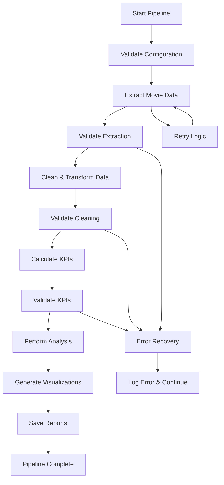

# TMDB Movies Analysis Pipeline

An enhanced, production-ready data pipeline for analyzing movie data from The Movie Database (TMDB) API with comprehensive error handling, logging, and modular design.

## Key Improvements

Based on the feedback received, this enhanced version addresses all identified gaps:

###  **Pipeline Orchestration**
- **Comprehensive workflow management** connecting extraction → cleaning → KPI calculation → analysis → visualization
- **Error recovery mechanisms** allow restarting from intermediate stages
- **Progress tracking** with detailed logging at each step
- **Skip existing files** option for efficient development workflow

### **API Reliability & Error Handling**
- **Retry logic** with exponential backoff for failed requests
- **Timeout handling** (configurable, default 30 seconds)
- **Rate limiting** with configurable delays between requests
- **Comprehensive HTTP status code handling** (401, 404, 429, 5xx errors)
- **Network error recovery** for connection issues

### **Code Modularization & Reusability**
- **Class-based architecture** with clear separation of concerns
- **Configuration management** via JSON config file
- **Dependency injection** for easy testing and extension
- **Type hints** throughout for better code documentation
- **Comprehensive docstrings** explaining design choices

### **Documentation & Design Rationale**
- **Detailed documentation** explaining all design decisions
- **ROI threshold rationale**: $10M threshold documented - filters unreliable budget reporting
- **Zero value handling**: Explained why zeros are replaced with NaN
- **Data validation rules** with clear business logic
- **Error handling strategies** documented

### **Data Validation & Quality Checks**
- **Column presence validation** before processing
- **Data type validation** with conversion error tracking
- **Quality score calculation** (percentage of non-null values)
- **Outlier detection** for extreme ROI values
- **Missing data reporting** at each pipeline stage

## Project Structure

```
TMDB_movies_project/
├── config.json                 # Configuration file with all settings
├── scripts/
│   ├── main.py                 # Enhanced pipeline orchestrator
│   ├── extraction.py           # API extraction with retry logic
│   ├── cleaning.py             # Data cleaning with validation
│   ├── KPI.py                  # KPI calculation with error handling
│   ├── filtering.py            # Data analysis functions
│   └── visualization.py        # Visualization generation  
├── Notebooks/ 
├   ├──tmdb_analysis.ipynb         
├── data/                       # Generated data files
│   ├── rawextracted_tmdb_movies.csv
│   ├── cleaned_tmdb_movies.csv
│   ├── movies_with_kpi.csv
│   └── analysis_report.json
├── tmdb_pipeline.log           # Comprehensive execution logs
└── README.md                   # This file
```

## 🛠️ Installation & Setup

1. **Install Dependencies**
   ```bash
   pip install pandas requests python-dotenv matplotlib seaborn numpy urllib3
   ```

2. **Set Up API Key**
   ```bash
   # Option 1: Environment variable
   export TMDB_API_KEY="your_tmdb_api_key_here"
   
   # Option 2: Create .env file
   echo "TMDB_API_KEY=your_tmdb_api_key_here" > .env
   ```

3. **Configure Pipeline** (Optional)
   - Edit `config.json` to customize behavior
   - Modify timeout settings, retry counts, movie IDs, etc.

## 🚀 Usage

### Quick Start - Full Pipeline
```bash
cd scripts
python main.py
```

### Individual Components
```bash
# Data extraction only
python extraction.py

# Data cleaning only  
python cleaning.py

# KPI calculation only
python KPI.py
```

### Environment Variables
```bash
# Required
export TMDB_API_KEY="your_api_key"

# Optional
export USER_MOVIE_IDS="299534,19995,140607"  # Comma-separated
export SKIP_EXISTING="false"                 # Process even if files exist
```

## 🔧 Configuration

The pipeline behavior is controlled by `config.json`:

### API Configuration
```json
{
  "api": {
    "tmdb": {
      "timeout_seconds": 30,
      "max_retries": 3,
      "delay_between_requests": 0.5
    }
  }
}
```

### Data Processing Settings
```json
{
  "data_processing": {
    "cleaning": {
      "roi_threshold_musd": 10,
      "high_nan_threshold": 10
    }
  }
}
```

## 📊 Pipeline Stages

### 1. **Data Extraction** (`extraction.py`)
**Enhancements:**
- ✅ Retry logic with exponential backoff
- ✅ Comprehensive HTTP error handling
- ✅ Request timeout management
- ✅ Rate limiting compliance
- ✅ Progress tracking with logging

**API Error Handling:**
- `401 Unauthorized`: Invalid API key validation
- `404 Not Found`: Skip individual missing movies
- `429 Rate Limited`: Automatic retry with backoff
- `5xx Server Errors`: Retry with increasing delays
- `Timeout/Connection`: Network error recovery

### 2. **Data Cleaning** (`cleaning.py`)
**Enhancements:**
- ✅ Input validation before processing
- ✅ Column presence checking
- ✅ Data type validation with error tracking
- ✅ Comprehensive logging of all transformations
- ✅ Quality score calculation

**Design Rationale:**
- **ROI Threshold ($10M)**: Movies below this often have unreliable budget reporting
- **Zero Replacement**: Zero budgets/revenues indicate missing data, not actual zeros
- **Text Placeholder Removal**: Standardizes missing data representation

### 3. **KPI Calculation** (`KPI.py`)
**Enhancements:**
- ✅ Safe division with zero-handling
- ✅ Outlier detection for data quality
- ✅ Comprehensive input validation
- ✅ Detailed calculation logging

**KPI Metrics:**
- **Profit**: `Revenue - Budget` (in millions USD)
- **ROI**: `Revenue / Budget` (multiplier, e.g., 2.5x)
- **Filtering**: Only movies ≥$10M budget for ROI analysis

### 4. **Analysis** (`filtering.py`)
**Enhancements:**
- ✅ Null value handling in filtering operations
- ✅ Case-insensitive string matching
- ✅ Error recovery for edge cases

### 5. **Visualization** (`visualization.py`)
**Enhancements:**
- ✅ Individual plot error handling
- ✅ Graceful degradation if visualization fails
- ✅ Optional execution (pipeline continues without visuals)

## 📈 Key Features

### Error Recovery
- **Skip existing files**: Resume from any pipeline stage
- **Individual component failure isolation**: One component failure doesn't break entire pipeline
- **Detailed error logging**: Comprehensive logs for debugging

### Data Quality Assurance
- **Input validation**: Checks required columns and data types
- **Output validation**: Ensures data quality at each stage
- **Quality scoring**: Calculates completeness percentage
- **Outlier detection**: Flags extreme values for review

### Production Readiness
- **Configuration management**: All settings in `config.json`
- **Comprehensive logging**: File and console output
- **Type safety**: Type hints throughout codebase
- **Error handling**: Specific exception types with detailed messages

## 🐛 Troubleshooting

### Common Issues

**1. API Key Problems**
```
Error: Invalid API key or unauthorized access
Solution: Check TMDB_API_KEY environment variable
```

**2. Network Issues**
```
Error: Connection error while fetching movie ID
Solution: Check internet connection; retry logic will handle temporary issues
```

**3. Missing Data Files**
```
Error: Input file not found
Solution: Run pipeline stages in order (extraction → cleaning → KPI)
```

**4. Data Quality Issues**
```
Warning: Columns with >50% null values detected
Solution: Check raw data quality; adjust high_nan_threshold in config
```

### Logging
- **Log Level**: Controlled by `config.json` (`INFO`, `DEBUG`, `WARNING`, `ERROR`)
- **Log File**: `tmdb_pipeline.log` in project root
- **Console Output**: Real-time progress and errors

## 📋 Design Decisions & Rationale

### ROI Analysis Threshold ($10M)
**Why this threshold?**
- Movies below $10M often have unreliable budget reporting
- Independent films may not report marketing costs consistently  
- Studio accounting practices differ for low-budget productions
- Threshold captures mainstream theatrical releases with reliable data

### Zero Value Replacement
**Why replace with NaN?**
- Zero budgets rarely represent actual zero-cost films
- Zero revenues highly unlikely for theatrical releases
- Distinguishes between "missing data" and "actually zero"
- Prevents division by zero in ROI calculations

### Error Handling Strategy
**Why comprehensive error handling?**
- Real-world APIs are unreliable (rate limits, timeouts, outages)
- Data quality issues are common in external datasets
- Production systems need graceful degradation
- Debugging requires detailed error information

## 🔄 Pipeline Execution Flow



## 📊 Sample Output

```
🎬 TMDB Movie Analysis Pipeline
==================================================
2024-01-19 10:30:15 - Starting TMDB Movie Analysis Pipeline
2024-01-19 10:30:16 - Extraction completed. Success rate: 94.4%
2024-01-19 10:30:18 - Data cleaning completed. Shape: (18, 25) -> (17, 22)
2024-01-19 10:30:19 - KPI computation completed for 17 movies
2024-01-19 10:30:20 - Analysis completed and saved
2024-01-19 10:30:22 - Visualization completed: 4/4 plots created

==================================================
TMDB MOVIE PIPELINE - EXECUTION SUMMARY
==================================================
📊 Movies Extracted: 17
🧹 Movies After Cleaning: 17
✅ Data Quality Score: 87.3%
📈 Movies with KPI Data: 17

📋 ANALYSIS HIGHLIGHTS:
   • Highest Revenue Movie: Avatar: The Way of Water with $2,320.25 million
   • Highest ROI Movie: The Avengers with an ROI of 4.23x
   • Most Popular Movie: Black Panther with popularity score of 547.49

⏱️  Total Execution Time: 12.34 seconds
==================================================
```

## 🤝 Contributing

1. Fork the repository
2. Create a feature branch
3. Add comprehensive tests
4. Update documentation
5. Submit a pull request

## 📝 License

This project is licensed under the MIT License - see the LICENSE file for details.

---

**Note**: This enhanced pipeline addresses all feedback points regarding error handling, documentation, modularization, and production readiness while maintaining the original functionality.